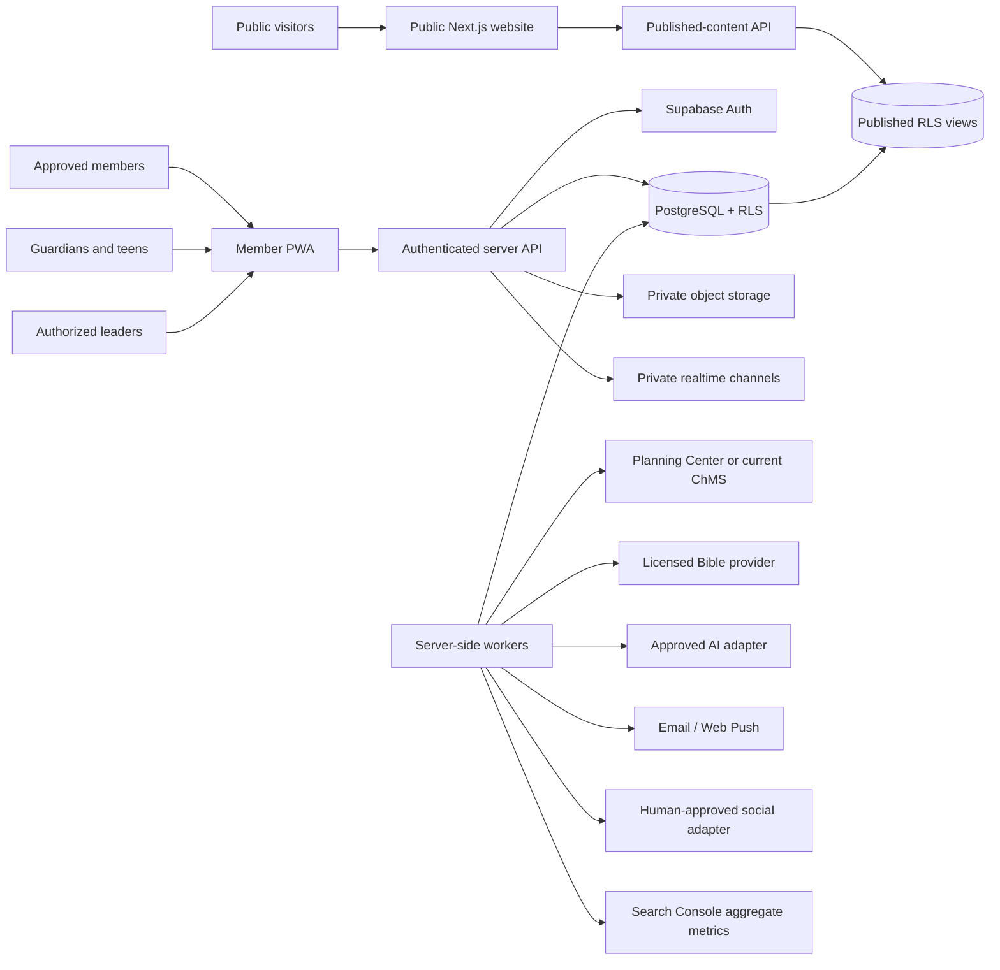
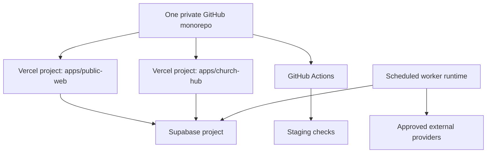
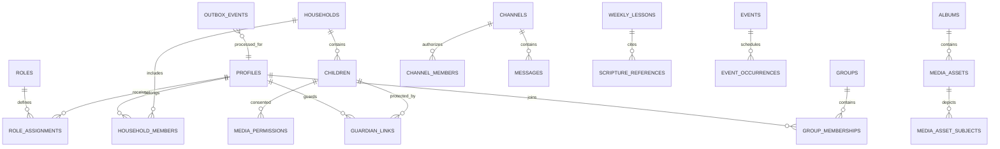
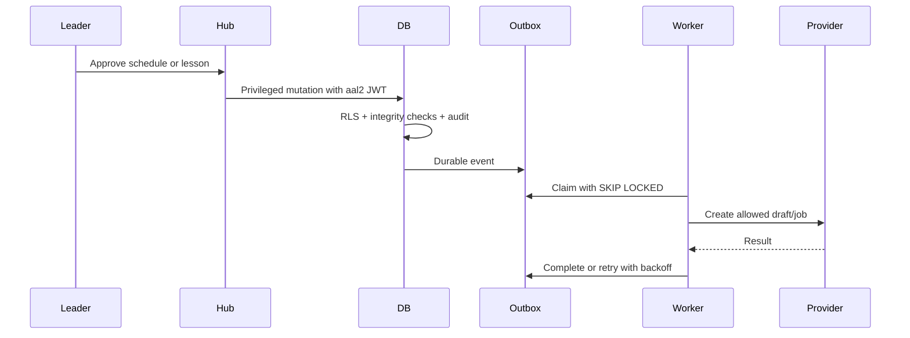

# System Architecture

## Context diagram

## Deployment topology

The initial worker folders remain in the monorepo. Split them only when an independent deployment boundary, vendor ownership boundary, duration limit, or multi-region service justifies the additional operational burden.

## Trust boundaries

### Public browser

May receive:

- public schedule projection
- public event projection
- published lessons and ministry content
- public assets
- browser-safe Supabase publishable key

Must never receive:

- service-role credential
- invitation pepper
- webhook secret
- member/household/child rows
- private channel membership
- prayer or safeguarding data

### Authenticated browser

Carries an end-user JWT. PostgreSQL combines `auth.uid()`, active role assignments, scope membership, and RLS. A URL or record identifier does not confer access.

### Server and workers

Server-only code may hold provider secrets and service credentials. Workers are dry-run by default, claim durable outbox events with `SKIP LOCKED`, and process idempotently. Logs must not include prayer text, child names, messages, or raw access tokens.

### External vendors

Each integration receives the minimum projection needed for its job. Advertising systems never receive member directories, child information, prayer details, ministry assignment, or private-community content.

## Application boundaries

### `apps/public-web`

- fully public Next.js App Router application
- canonical metadata, sitemap, robots, JSON-LD
- Plan-a-Visit and voluntary contact forms
- public aggregate analytics only
- no authenticated member queries

### `apps/church-hub`

- noindex/no-store member PWA
- Supabase SSR auth and `proxy.ts` session refresh
- role-filtered administration navigation
- server APIs that re-check authorization
- service worker that never caches private API/auth responses

### `apps/workers`

- Planning Center synchronization
- notification job creation
- Search Console synchronization
- social publication gate
- AI draft/embedding gate

## Database domains

## Event-driven flow

## Authentication and invitations

- Public sign-up is disabled.
- Magic-link login uses `shouldCreateUser: false`.
- New users are created through an authenticated invitation workflow.
- Auth callback accepts only a relative internal `next` path.
- The database stores a hash, not the raw invitation token.
- Acceptance locks the invitation row, validates expiration/revocation/email, activates the profile, and writes role assignments and an audit event atomically.

## Realtime

Realtime tables retain PostgreSQL as the durable source. `messages`, `posts`, and user notification jobs are added to the private publication. RLS remains authoritative for who can subscribe and read.

## Storage

- `member-media`: private
- `child-media`: private
- `public-site-assets`: public, but only approved content roles can write

Private media is readable only when an approved database media record maps the exact bucket/path to an album the user may access. Upload URLs should be generated server-side after authorization.

## Failure modes and fallbacks

| Failure                     | Behavior                                                                          |
| --------------------------- | --------------------------------------------------------------------------------- |
| Public database unavailable | Show a reviewed static service fallback plus status alert; do not invent changes. |
| Hub unavailable             | Publish phone/email fallback and use existing ChMS/communications.                |
| Planning Center unavailable | Follow the rehearsed manual Sunday check-in plan.                                 |
| Worker failure              | Event remains pending or retries with bounded exponential backoff.                |
| Email failure               | Invitation is revoked before retry where delivery cannot be completed.            |
| AI unavailable              | Approved source content remains available; no generated answer is required.       |
| Social adapter unavailable  | Draft remains approved/scheduled but unpublished; no silent fallback.             |

## Master ecosystem extensions

### PWA and offline boundary

The service worker caches only the shell and the explicit offline-safe schedule/weekly-lesson endpoints. Auth, personalized pages, messages, prayer, households, children, check-in, admin, and all other APIs are network-only. This replaces a broad stale-while-revalidate model with a classified cache allowlist.

### Web push

`push_subscriptions` are owned by the authenticated profile through RLS. The notification worker creates generic, approved push jobs; `push-delivery` claims them through a concurrency-safe RPC and sends with server-only VAPID credentials. Dry-run mode performs read-only inspection and never claims a job.

### Private realtime

Private topics follow `scope:id`, with database authorization through `can_access_realtime_topic`. The client joins only private channels. Presence is sparse and disabled for Kids-class topics. Durable messages remain in PostgreSQL.

### Graph-aware fellowship proposals

The rotation engine combines hard constraints, pairing history, content-free relationship signals, newcomer/welcome support, deterministic placement, and pairwise local-swap refinement. It stores a reproducible proposal and never activates memberships before approval.

### Kids Kingdom adapters

`@church/kids-checkin` defines ChMS, kiosk, label-printer, and short-lived credential contracts. New tables register devices, credentials, print jobs, and release evidence. The existing approved ChMS remains the early source of truth and custom release is feature-gated.

### Curriculum and outreach

The AI layer can create review-only curriculum and image-prompt drafts from approved source IDs. The outreach layer imports aggregate search performance, scores opportunities, creates people-first briefs, tracks local profile/Ad Grants readiness, and prohibits sensitive-audience signals.

### Production promotion

Vercel previews and staging support normal iteration. `main` requires a protected manual production-promotion workflow so the public and private applications can be approved and deployed independently from the same commit.
