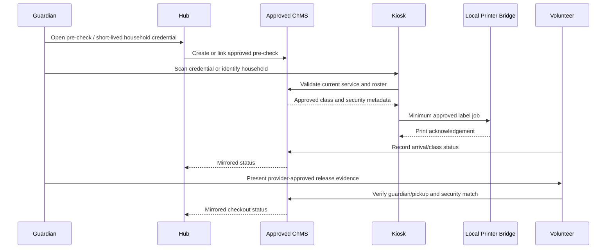

# Kids Kingdom Kiosk, Labels, Media, and Release

## Integration-first decision

The Church Hub provides a parent-friendly layer. Planning Center or another approved church management/check-in system remains the early safety-critical system of record for identity, check-in, classroom assignment, security labels, and release.

The repository supplies provider-neutral contracts so the church can integrate without hard-coding one vendor into every interface.

## Operational flow

## Credential boundary

A short-lived HMAC credential may identify a household and service session. It is opaque, expires, is bound to one service session, and is stored as a hash when persisted. It is not sufficient authority to release a child. Raw credential hashes are restricted to MFA-gated safety roles and service workers; guardians do not receive the credential table.

Custom release remains disabled unless:

- the approved system of record is selected;
- safeguarding and privacy policies are approved;
- kiosk and printer threat models pass;
- volunteers are trained;
- guardian and authorized-pickup cases pass;
- manual Sunday fallback is rehearsed;
- a documented safety review identifier is configured;
- leadership explicitly approves a limited pilot.

## Kiosk and printer controls

- Register each kiosk device with a hashed device credential.
- Approve, suspend, and retire devices.
- Use browser lockdown/device management where available.
- Keep service-role and printer-network credentials out of the browser.
- Use a local bridge with an authenticated, narrow print queue.
- Print only minimum operational fields: display label, class, provider security code, and concise approved safety flags.
- Never print narrative medical, custody, counseling, or pastoral records.
- Record job hash, status, attempts, error, and printed time.
- Keep raw printer payloads unavailable to guardians and ordinary volunteers; provider bridges use service-role workers, while volunteers use the narrow assigned-roster projection.

## Release evidence

The raw release-verification table is restricted to safety roles. Guardians use `get_my_child_release_history`, which returns only the child-scoped outcome, method, provider category, service session, and time. It omits provider references, internal notes, and verifier identity.

Record:

- service session;
- child;
- authoritative provider;
- verification method;
- provider reference;
- trained verifying volunteer;
- matched, rejected, or escalated result;
- timestamp;
- minimum restricted notes when needed.

A rejected or ambiguous release follows the written safeguarding escalation and manual fallback; the app never “decides” the dispute.

## Private media

Media must move through validation, malware scanning, metadata removal, consent-scope checks, moderator review, private storage, short-lived signed access, report/takedown, retention, and audit.

A viewer watermark, disabled context menu, and expiring URL discourage casual redistribution but cannot prevent screenshots, screen recording, or photography. Policy, training, consent, access minimization, and response procedures are the meaningful controls.

## Parent connections

Parent connections and playdates are adult-to-adult opt-in. Each adult controls which contact fields are shared. The platform does not publish a child’s school, home address, exact recurring schedule, precise current location, custody details, or medical records.
