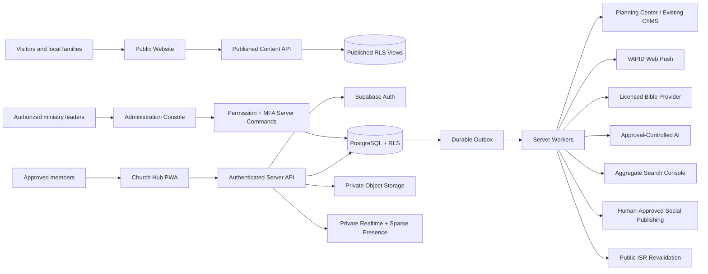

# Boston Church Lowell / Northwest Master Operating System

## Purpose

This document merges the original church-platform blueprint with the additional digital-ministry ecosystem proposal into one buildable operating system. It is the controlling product map for the repository. The detailed reconciliation is recorded in `SOURCE_INTEGRATION_NOTES.md`.

The platform has three connected experiences and one shared control plane:

1. **Public Website** — accurate public identity, Plan a Visit, ministries, teaching, events, local discovery, and voluntary visitor requests.
2. **Church Hub PWA** — approved-member identity, weekly teaching, Bible companion, community channels, events, households, Kids Kingdom status, and parent connections.
3. **Ministry Administration Console** — content approval, access, groups, safeguarding, moderation, outreach, audit, and system health.
4. **Master Control Plane** — PostgreSQL/RLS, private storage, realtime authorization, durable workers, provider adapters, analytics boundaries, and production release gates.

## Unified system map



## Repository decision

Use one church-owned private monorepo with two initial Vercel projects:

```text
apps/public-web       public website
apps/church-hub       private PWA + administration
apps/workers          event-driven and scheduled jobs
packages              shared policy, domain, integration, and UI modules
supabase              schema, RLS, storage, functions, seed, and pgTAP tests
docs                  architecture and operating policies
tests                 unit, integration, authorization, accessibility, E2E
```

The workers remain in the monorepo until scale, runtime duration, vendor ownership, or independent release controls justify separation.

## Master capability map

### Public Experience

- canonical service schedule and date-specific overrides;
- Plan a Visit, directions, parking, accessibility, and first-Sunday expectations;
- ministries, Kids Kingdom, teens, family groups, Bible studies, sermons, events, and community service;
- JSON-LD, sitemap, event pages, transcripts, authorship, and aggregate analytics;
- incremental/static publishing with protected on-demand revalidation;
- voluntary visit, Bible-study, family-group, and access requests.

### Member Experience

- invitation-only onboarding and passwordless or passkey-ready authentication;
- MFA for privileged roles;
- This Week home, weekly lesson, Scripture references, resources, notes, and discussion prompts;
- chronological and ministry-aware community channels;
- private realtime broadcast and sparse channel presence;
- events, registrations, calendar, volunteering, and reminders;
- household, guardians, authorized pickup, media consent, class status, and parent connections;
- privacy-aware PWA installation, offline-safe snapshots, and VAPID web push.

### Administration

- single-source schedule and multi-surface publishing;
- AI-assisted seven-day curriculum, group questions, captions, translation, video, and image-prompt drafts;
- access-request review and single-use invitation issuance;
- constraint-based and graph-aware fellowship proposals;
- Kids Kingdom integration, kiosk registry, label bridge, private media, release evidence, and fallback readiness;
- moderation and safeguarding queues;
- aggregate Search Console opportunities, people-first briefs, local-profile readiness, campaign planning, visitor CRM, and approval-controlled social publishing;
- audit, retention, backups, incidents, account ownership, release evidence, and system health.

## Deliberate reconciliations

The additional proposal contained ambitious ideas that are valuable only when implemented within stricter boundaries. The master architecture adopts them as follows:

| Proposed idea                                        | Master implementation                                                                                                                                                                              |
| ---------------------------------------------------- | -------------------------------------------------------------------------------------------------------------------------------------------------------------------------------------------------- |
| Cache recent posts and lessons for weak connectivity | Cache only explicitly approved, non-personalized schedule and lesson snapshots. Chats, households, children, prayer, auth, and personalized APIs remain network-only.                              |
| Real-time presence for all social areas              | Use private RLS-authorized topics and sparse presence. Kids-class presence is disabled by policy; no cross-channel tracking.                                                                       |
| Interaction-based graph partitioning                 | Use content-free, leadership-attested aggregate relationship signals, pairing history, newcomer support, and local-swap refinement. Never inspect message text, prayer, child, or counseling data. |
| Custom QR child check-in and release                 | Build provider-neutral kiosk and label adapters, but keep Planning Center/current ChMS as the early system of record. A QR credential is not release authority.                                    |
| Prevent child-photo downloading                      | Use consent scope, private storage, signed expiry, audit, takedown, and visible viewer watermarks. State honestly that screenshots cannot be prevented.                                            |
| Automatically create local SEO pages from trends     | Generate people-first content briefs only. Approved facts, substantive sections, communications review, and no mass programmatic publishing are mandatory.                                         |
| Automatically generate Bible curriculum and creative | Generate drafts from approved source documents; require ministerial/communications approval and citations before use.                                                                              |
| Find people searching for God                        | Observe aggregate search demand and invite voluntary contact. Never identify, infer, or target an individual based on religious beliefs or private spiritual activity.                             |
| Main branch as staging through branch tricks         | Use previews/staging plus a protected manual production-promotion workflow with church-owned environment approvals.                                                                                |

## Core data domains

```text
Identity and Access
Households and Guardians
Ministries and Life Stages
Groups and Relationship Graph
Teaching and Licensed Scripture References
Community and Realtime Topics
Events and Volunteer Assignments
Children, Classes, Check-in Mirrors, Kiosks, Labels, Release Evidence
Media, Consent, Review, Signed Access, Takedown
Notifications, Push Subscriptions, Delivery Receipts
AI Sources, Requests, Citations, Curriculum, Image Prompts
Outreach, Search Opportunities, Campaigns, Visitor CRM, Readiness
Governance, Audit, Retention, Incidents, Backups, Release Gates
```

## Non-negotiable authority model

- Browser UI visibility is not authorization; PostgreSQL RLS and server permission checks are authoritative.
- Public code never receives service-role credentials or private-table access.
- Developers do not inherit child, prayer, pastoral, or safeguarding visibility.
- Privileged roles require MFA/AAL2 for privileged actions.
- A child under 13 receives no independent social account.
- Adult-to-teen unrestricted direct messaging is disabled.
- AI receives approved, permission-filtered sources only and never owns publication or pastoral decisions.
- Advertising platforms receive no member, child, prayer, counseling, ministry-assignment, or private-channel data.
- Kids release follows the approved system of record and trained-person protocol.

## Build order

```text
Governance and ownership
→ canonical public information
→ secure member identity and permissions
→ weekly teaching, events, groups, and notifications
→ moderated community + private realtime
→ proven Kids Kingdom integration and media controls
→ graph-aware fellowship proposals
→ approved-source AI curriculum and Bible companion
→ responsible local discovery, campaigns, and visitor CRM
→ operational maturity, restore testing, and independent review
```

## Definition of success

The operating system succeeds when it makes Sunday information reliable, weekly discipleship easier to follow, approved community communication calmer, new relationships more likely, Kids Kingdom operations safer, outreach more useful, and leadership work more accountable—without turning spiritual participation, children, or private ministry into an advertising or engagement dataset.
